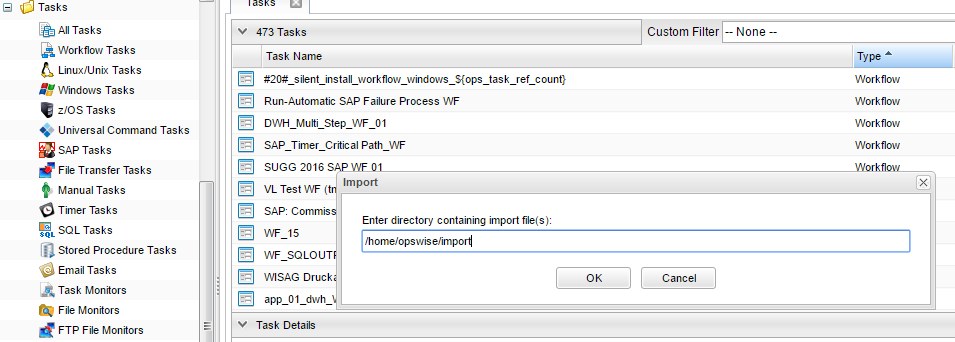
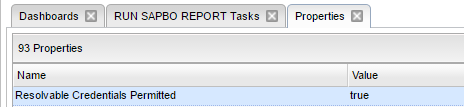
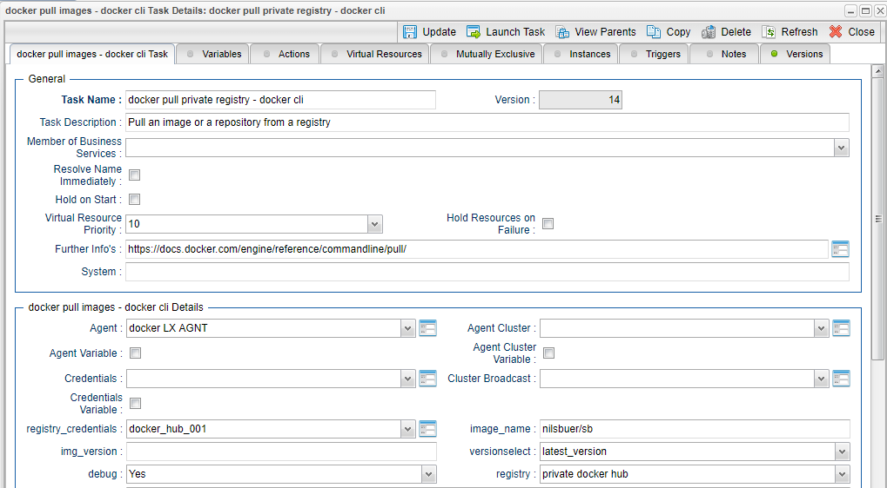
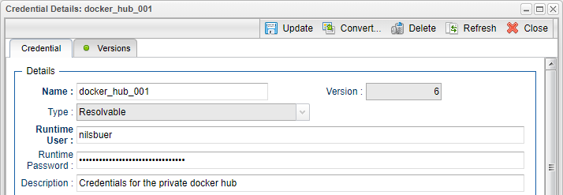
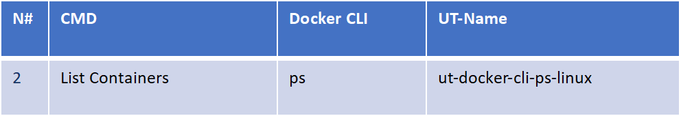
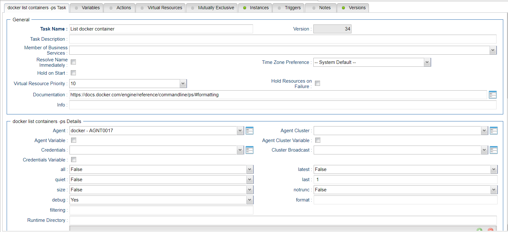
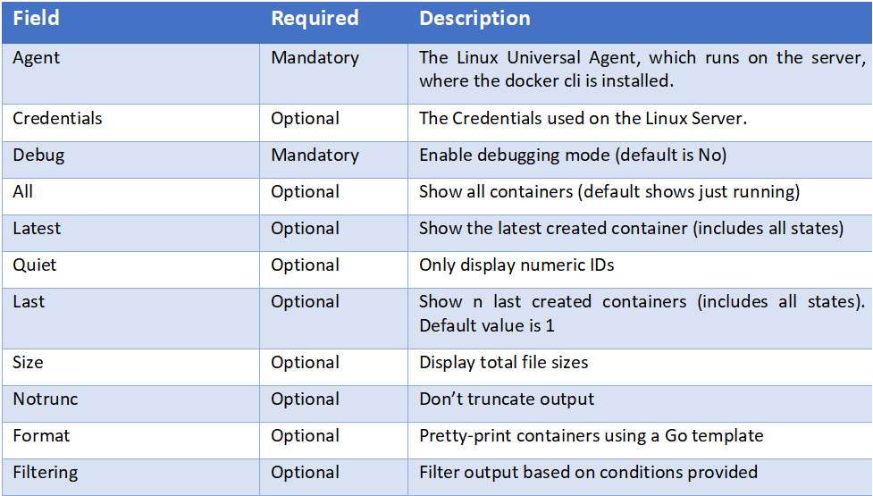
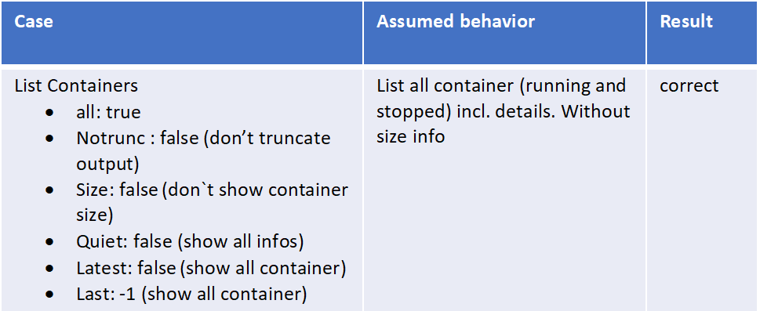

# ut-docker-cli-ps-linux

# 4	Installation
# 4.1	Software Requirements

Universal Task name: ut-docker-cli-images-linux

Related UAC XML Files for template and task: Github repository
Software used: 
For the set-up you need:
1.	Universal Controller 6.4.5.x (any platform: Linux, Windows or SaaS Cloud) 
2.	Universal Agent 6.4.2.2 or higher installed on a Linux Server
3.	Docker engine with version 17.09.1-c or higher installed on a Linux server

# 4.2	Installation Steps
The following describes the installation steps:

**1.	Install the docker engine and a Universal Agent on a Linux Server e.g. Open SUSE**
The following provides a sample set-up for Open SUSE. For other Linux distribution the set-up is similar (check with google). The set-up is provided here to have some guidance on the general step. The steps may vary depending on your landscape.

**# Install Agent on docker engine**
sh ./unvinst --network_provider oms --oms_servers 7878@<oms_ip> --oms_port 7878 --oms_autostart no --ac_netname OPSAUTOCONF --opscli yes 
where:
•	<oms_ip> is the IP or hostname of your oms server.
•	7878 is the default oms port

**# update repro**

zypper update

**# install docker engine package**

zypper in docker

**# Start the Docker daemon.**

systemctl start docker

**# start the docker daemon at boot**

systemctl enable docker

**# Create new docker user** 

The docker package creates a new group named docker. Users, other than root user, must be part of this group to interact with the Docker 
daemon. You can add users with this command syntax:

sudo /usr/sbin/usermod -a -G docker <linux_user>
sudo /usr/sbin/usermod -a -G docker ubroker

**# enable external network access**

OpenSuse: Network Devices -> Network Settings -> Routing menu (f) and check the Enable IPv4 Forwarding box.

**# Test the Docker installation.**

Type in a command shell:
docker run ubuntu /bin/echo 'Hello world'

**2.	Import each docker-cli Universal Task including the Universal Template to your Controller**

Go to “All Tasks” and load via the Import functionality the Universal Task configuration into the Controller. 

Image1

Image2

# 5	Universal Task Configuration
**1.	Activate: Resolvable Credentials in Universal Automation Center:**

Image3

**2.	Fill Out the Universal Task for each docker cli command, which you want to execute:**

In the example below the Task to pull a docker image “ut_docker-cli_pull_linux” is shown.

Image4

Fill out or select the required Credentials e.g. for docker private registry. 
In the example below the docker registry credentials are shown:

Image5

# 6	Universal Tasks for Docker Container

The following chapter describes the provided docker-cli Universal Tasks.

# 6.1	List Containers
Image6

**Task Screenshot :**

Image7

**Field Description:**

Image8

To understand and maximize use of Format and filtering command please follow the below link
https://docs.docker.com/engine/reference/commandline/ps/#formatting
https://docs.docker.com/engine/reference/commandline/ps/#filtering

# 7	Test Cases

The following basic test cases has been performed:

Image9

# 8	Document References
There are no document references.
